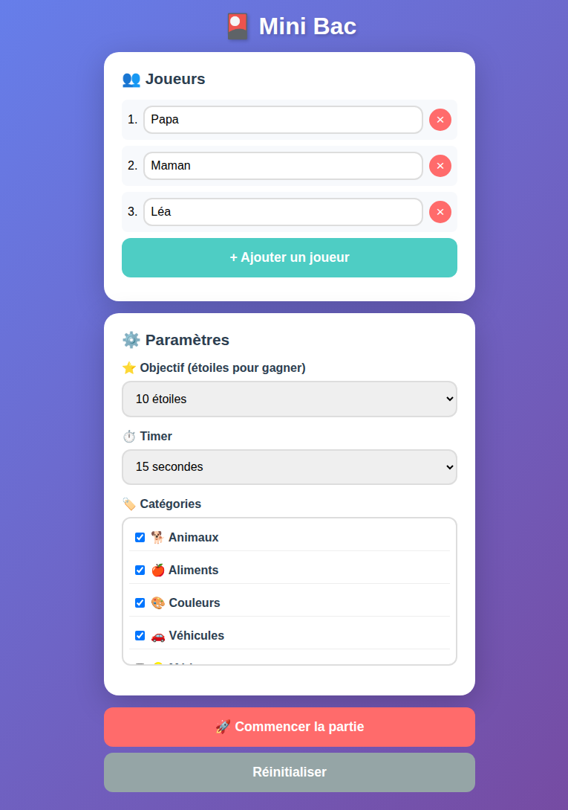

# 🎴 Mini Bac - Jeu de Famille

Jeu de rapidité et de vocabulaire inspiré du "Petit Bac", prévu pour jouer en famille.



## 🚀 Fonctionnalités

- ✅ Fonctionne **hors ligne** (PWA)
- ✅ Installable sur **iOS et Android**
- ✅ 2 à 10 joueurs
- ✅ Catégories configurables
- ✅ Timer configurable
- ✅ Score par étoiles
- ✅ Paramètres sauvegardés

## 📱 Installation

### iOS (Safari)
1. Ouvrir le site
2. Appuyer sur "Partager" 
3. Ajouter à l'écran d'accueil

### Android (Chrome)
1. Ouvrir le site
2. Appuyer sur "Installer"

## 🎮 Règles du jeu

1. Le maître du jeu tient le téléphone
2. Une lettre et une catégorie sont affichées
3. Les joueurs cherchent un mot correspondant
4. Le maître du jeu valide en appuyant sur le nom du joueur
5. Le premier à atteindre le nombre d'étoiles défini gagne !

## 🏷️ Catégories disponibles

Animaux, Aliments, Couleurs, Véhicules, Métiers, Maison, Vêtements, Nature, Pays, Villes, Prénoms, Sports, Films, Musique, Émissions, Jouets...

## 🔧 Développé avec

- HTML/CSS/JS (vanilla)
- PWA (Service Worker)
- GitHub Pages

---

## 🧪 Tests techniques

Avant chaque livraison, exécuter ces tests :

```bash
# 1. Vérifier que le site charge (HTTP 200)
curl -sI https://alfredfaeric.github.io/mini-bac/ | head -1

# 2. Vérifier le titre
curl -sL https://alfredfaeric.github.io/mini-bac/ | grep -o "Mini Bac"

# 3. Vérifier le manifest.json
curl -sL https://alfredfaeric.github.io/mini-bac/manifest.json | grep -o "Mini Bac"

# 4. Vérifier le service worker
curl -sI https://alfredfaeric.github.io/mini-bac/sw.js | head -1

# 5. Vérifier les catégories (au moins 4)
curl -sL https://alfredfaeric.github.io/mini-bac/ | grep -c "Animaux"

# 6. Vérifier PWA installable (iOS)
curl -sL https://alfredfaeric.github.io/mini-bac/manifest.json | grep -o "start_url"
```

---

## Credits

**Développement** : Alfred (assistant IA OpenClaw)

**Idée originale** : Eric

---

🎲 Créé pour jouer en famille !
